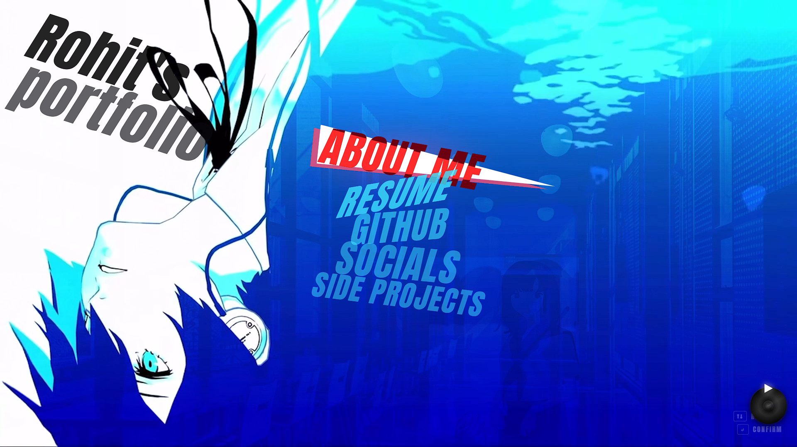
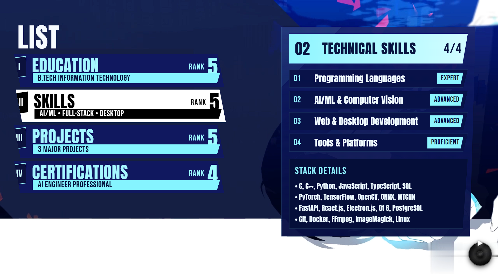

# Persona 3 Reload Portfolio

A modern, interactive portfolio website inspired by Persona 3 Reload's UI design. Built with React and featuring smooth animations, dynamic content, and a unique gaming aesthetic.


## 🎮 Features

- **Persona 3 Themed UI** - Authentic design inspired by Persona 3 Reload
- **Interactive Navigation** - Smooth page transitions with Framer Motion
- **Dynamic Content** - Real-time GitHub stats integration
- **Responsive Design** - Optimized for desktop and mobile devices
- **Background Music** - Looping soundtrack with CD player controls
- **Click Sound Effects** - Interactive audio feedback
- **Multiple Sections:**
  - About Me - Personal information and specializations
  - Resume - Education, skills, projects, and certifications
  - GitHub - Project showcase (coming soon)
  - Socials - Connect via GitHub, LinkedIn, and Email
  - Side Projects - Featured work and demos

## 🚀 Live Demo

[View Live Portfolio](https://rohitpoul.github.io/Person-3-Reload-Potfolio/)

## 📸 Screenshots

### Main Menu


### About Me


### Resume


## 🛠️ Tech Stack

- **Frontend Framework:** React 19.2.4
- **Build Tool:** Vite 8.0.1
- **Routing:** React Router DOM 7.14.0
- **Animations:** Framer Motion 12.38.0
- **Styling:** Custom CSS with Persona 3 theme
- **APIs:** GitHub REST API for real-time stats

## 📦 Installation

### Prerequisites

- Node.js 18+ 
- npm or yarn

### Setup

1. Clone the repository:
```bash
git clone https://github.com/RohitPoul/Person-3-Reload-Potfolio.git
cd Person-3-Reload-Potfolio
```

2. Install dependencies:
```bash
npm install
```

3. Start the development server:
```bash
npm run dev
```

4. Open your browser and navigate to:
```
http://localhost:5173
```

## 🏗️ Build for Production

```bash
npm run build
```

The production-ready files will be in the `dist/` folder.

## 📁 Project Structure

```
persona3-portfolio/
├── src/
│   ├── assets/          # Media files (audio, images, videos)
│   ├── components/      # Reusable UI components
│   │   ├── MusicPlayer.jsx
│   │   ├── P3Menu.jsx
│   │   ├── PageTransition.jsx
│   │   └── Socials.jsx
│   ├── pages/           # Route pages
│   │   ├── AboutMe.jsx
│   │   ├── ResumePage.jsx
│   │   ├── GitHubPage.jsx
│   │   └── SideProjPage.jsx
│   ├── hooks/           # Custom React hooks
│   │   └── useClickSound.js
│   ├── services/        # API services
│   │   └── githubService.js
│   ├── styles/          # CSS files
│   │   ├── App.css
│   │   └── index.css
│   ├── App.jsx          # Main app component
│   └── main.jsx         # Entry point
├── public/              # Static assets
├── config/              # Configuration files
└── package.json
```

## ⚙️ Configuration

### GitHub Stats

To display your own GitHub stats, update the username in `src/services/githubService.js`:

```javascript
const GITHUB_USERNAME = 'YourGitHubUsername';
```

### Personal Information

Update your information in:
- `src/pages/AboutMe.jsx` - Personal details and bio
- `src/pages/ResumePage.jsx` - Education, skills, projects
- `src/components/Socials.jsx` - Social media links

## 🎨 Customization

### Colors

The Persona 3 theme uses these primary colors:
- **Red:** `#dc2626` (Primary accent)
- **Blue:** `#3ce2ff` (Secondary accent)
- **Dark:** `#0a0e27` (Background)

### Fonts

- **Anton** - Titles and headers
- **Bebas Neue** - Labels and navigation
- **Montserrat** - Body text

## 🎵 Audio Files

The portfolio includes:
- Background music (looping soundtrack)
- Click sound effects

**Note:** Audio files are not included in the repository. Add your own audio files to `src/assets/audio/`.

## 📱 Browser Support

- Chrome (latest)
- Firefox (latest)
- Safari (latest)
- Edge (latest)

## 🤝 Contributing

Contributions are welcome! Feel free to:
1. Fork the repository
2. Create a feature branch
3. Commit your changes
4. Push to the branch
5. Open a Pull Request

## 📄 License

This project is licensed under the MIT License - see the [LICENSE](LICENSE) file for details.

## 👤 Author

**Rohit Poul**

- GitHub: [@RohitPoul](https://github.com/RohitPoul)
- LinkedIn: [rohit-poul](https://www.linkedin.com/in/rohit-poul-403a41289)
- Email: poulrohit258@gmail.com

## 🙏 Acknowledgments

- Persona 3 Reload by Atlus for design inspiration
- React and Vite communities for excellent tools
- Framer Motion for smooth animations

## 📝 Notes

- This is a personal portfolio project inspired by Persona 3 Reload's UI design
- All Persona 3 assets and trademarks belong to Atlus
- This project is for educational and portfolio purposes only

---

⭐ If you like this project, please give it a star on GitHub!
